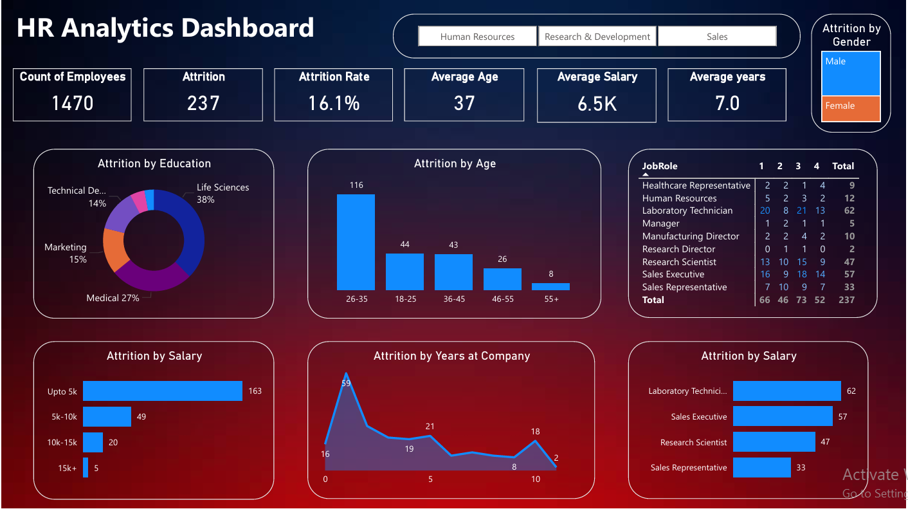

## 📊 HR Analytics Dashboard (Power BI)

This project analyzes HR data using Power BI to uncover employee attrition trends, workforce demographics, salary insights, and job role analysis.

## 📸 Dashboard Preview

### 🔹 Key Insights
- Total Employees: 1470  
- Attrition Count: 237  
- Attrition Rate: 16.1%  
- Average Age: 37 Years  
- Average Salary: 6.5K  
- Average Years at Company: 7.0 Years  
- Attrition by Education  
- Attrition by Age Group  
- Attrition by Salary Slab  
- Attrition by Job Role  
- Attrition by Gender  
- Attrition by Years at Company  

### 🛠 Tools Used
- Power BI Desktop  
- DAX  
- Data Modeling  
- Data Visualization  

### 📂 Files
- `HR_Analytics_Dashboard.pbix` – Power BI report  
- `dashboard.png` – Dashboard preview  

### 📌 How to Use
Download the `.pbix` file and open it in Power BI Desktop.
